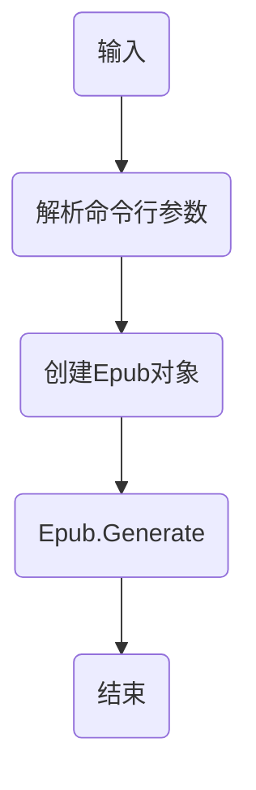
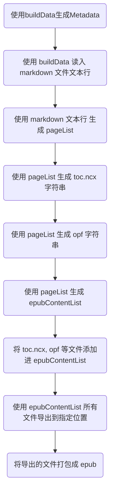

# 程序执行流程

## Epub Builder Flow Chart

```mermaid
graph TD
    A(输入)
    B(解析命令行参数)
    C(创建Epub对象)
    D(Epub.Generate)
    E(结束)
    
    A --> B --> C --> D --> E
```

### Epub.Generate Flow Chart

```mermaid
graph TD
    A(使用buildData生成Metadata)
    B(使用 buildData 读入 markdown 文件文本行)
    C(使用 markdown 文本行 生成 pageList)
    D(使用 pageList 生成 toc.ncx 字符串)
    E(使用 pageList 生成 opf 字符串)
    F(使用 pageList 生成 epubContentList)
    G(将 toc.ncx, opf 等文件添加进 epubContentList)
    H(使用 epubContentList 所有文件导出到指定位置)
    I(将导出的文件打包成 epub)
    
    A --> B --> C --> D --> E --> F --> G --> H --> I
```